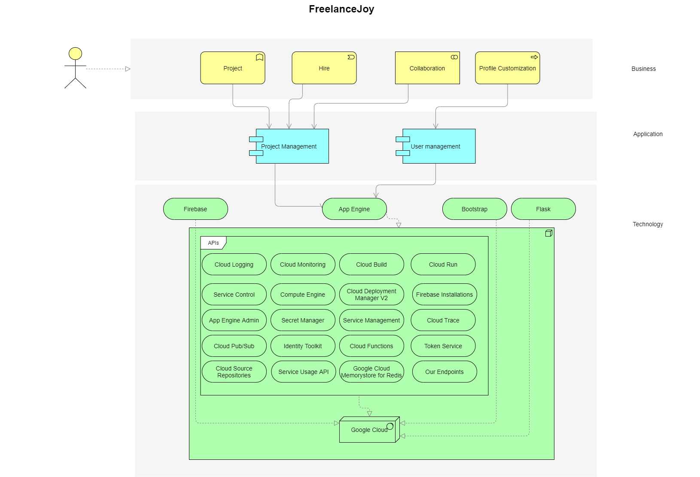

# Architecture

## Firebase
Firebase provides a real-time database and back-end as a service. 
The service provides application developers an API that allows application data  
to be synchronized across clients and stored on Firebase's cloud. 
 
The major advantage here is that you can designate a collection in Firebase 
with a particular schema and authorization access, and queue background jobs with Firebase directly. 
You can then set a cloud function to trigger on creation, perform some task, 
and update the queue item with the status of the transaction. 
 
Other major advantages would be realtime notifications, realtime chat/messaging, synced application state. 

## App Engine
Google App Engine is a Platform as a Service and cloud computing platform 
for developing and hosting web applications in Google-managed data centers. 
Applications are sandboxed and run across multiple servers. 
 
The major advantages are: 
<ul>
    <li>no need to set up a server</li>
    <li>instant for-free nearly infinite scalability</li>
    <li>spikey traffic and rather unpredictable</li>
    <li>server monitoring tools</li>
    <li>pricing that fits your actual usage and isn't time-slot based</li>
    <li>the ability to chunk long tasks into 30 second pieces</li>
    <li>direct filesystem access</li>
</ul> 
 
## Bootstrap
Bootstrap is a free and open-source CSS framework directed at responsive, 
mobile-first front-end web development. 
It contains CSS- and JavaScript-based design templates for typography, forms, buttons, navigation, 
and other interface components. 
 
Major advantage - speeds up production time. 
 

## Flask
Flask is a micro web framework written in Python. 
It is classified as a microframework because it does not require particular tools or libraries. 
It has no database abstraction layer, form validation, 
or any other components where pre-existing third-party libraries provide common functions. 
 
Major advantages - low complexity, dependency free & easy to learn language. 

## Cloud Logging API		
Writes log entries and manages your Cloud Logging configuration. 
			
## Cloud Monitoring API		
Manages your Cloud Monitoring data and configurations. 
			
## Cloud Build API
Creates and manages builds on Google Cloud Platform. 
			
## Service Control API	
Provides control plane functionality to managed services, such as logging, monitoring, and status checks. 
				
## Compute Engine API		
Creates and runs virtual machines on Google Cloud Platform. 
				
## Cloud Deployment Manager V2 API	
The Google Cloud Deployment Manager v2 API provides services for configuring, 
deploying, and viewing Google Cloud services and APIs via templates which specify deployments of Cloud resources. 
		
## App Engine Admin API
Provisions and manages developers' App Engine applications. 
			
## Secret Manager API
Stores sensitive data such as API keys, passwords, and certificates. Provides convenience while improving security. 
			
## Cloud Pub/Sub API
Provides reliable, many-to-many, asynchronous messaging between applications. 

## Identity Toolkit API
The Google Identity Toolkit API lets you use open standards to verify a user's identity. 
			
## Cloud Source Repositories API
Accesses source code repositories hosted by Google. 
		
## Service Usage API
Enables services that service consumers want to use on Google Cloud Platform, 
lists the available or enabled services, or disables services that service consumers no longer use. 
				
## Service Management API
Google Service Management allows service producers to publish their services on Google Cloud Platform 
so that they can be discovered and used by service consumers. 
				
## Cloud Functions API						
Manages lightweight user-provided functions executed in response to events. 

## Google Cloud Memorystore for Redis API
Creates and manages Redis instances on the Google Cloud Platform. 

## Cloud Run API
Deploy and manage user provided container images that scale automatically based on HTTP traffic. 
						
## Firebase Installations API	
Manages operations on Firebase DB. 
			
## Cloud Trace API
Sends application trace data to Cloud Trace for viewing. 
					
## Token Service API
The Token Service API lets you exchange an ID token or a refresh token for an access token and a refresh token, 
which you can use to securely call your own APIs. 
				
## Endpoints API
REST APIs, developer portal, metrics.