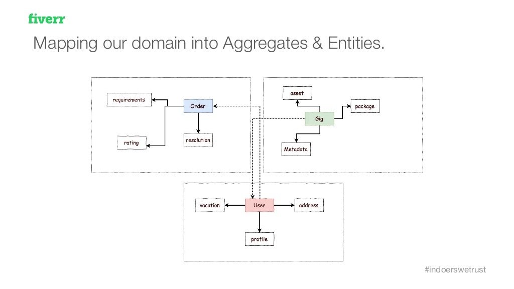
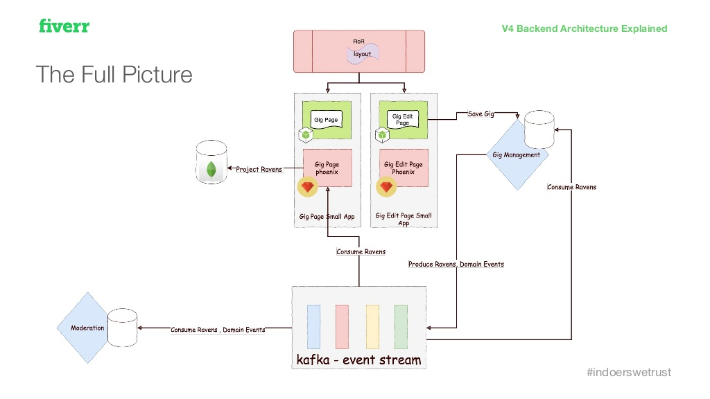

# Existing Solutions
---
## Fiverr

Fiverr.com was founded by two young entrepreneurs from Israel. 
Micha Kaufman and Shai Wininger created the site, driven by the idea that the normal 9 hours working day is not the only way to earn your income. 
 
Wininger came up with the concept of a marketplace that would provide a two sided platform for people to
buy and sell a variety of digital services typically offered by freelance contractors. 
   
The site was launched in February, 2010 and it has become one of the top 200 sites on the Internet today.
Services offered on the site include writing, translation, graphic design, video editing and programming.

Fiverr’s services start at US$5, and can go up to thousands of dollars with Gig Extras. 
Each service offered is called a "gig".

  
  
## Used Technologies
**Programming languages:**

 
 
 
 
 
 
**Persistence:**

 
 
 
 
 
 
**Messaging and Data integration:**

**DevOps:**

 
 
 
 
 

## Architecture
**Chimera**

A Fiverr microservice template consisting of:

1. a REST API endpoint for synchronous reads

2. a RabbitMQ consumer for asynchronous writes residing in the same Repo, sharing the same business logic code

**Ravens**

A Fiverr State Change Event describing a change in the attributes of an entity followed by a command to a chimera.

**Perseus**

The Fiverr Slayer of Ruby on Rails - a NodeJS based micro-frontend structured as a ReactJS SPA for a specific vertical (gig page, order page, checkout page)

**Phoenix**

A Fiverr presentation data aggregator - consuming Ravens and building a read optimized projection of the data consumed by Perseus to generate views. Can renew its data view by replaying the Ravens.

## Marketing approaches
    
**Branding and guerilla marketing over product and SEO**

The whole story of the site was planned out before the product was brought to life: “I think a lot of startups are 
looking at the technology before even looking at the product, at the story. At Fiverr we invested most of our initial 
time, not in creating the product, but in creating a story around it that would make sense for everyone.”

This strategy can be seen in the way Wininger (whose background in design and branding) and his team set about raising 
public awareness of the Fiverr. Instead of spending on SEO or PR, they approached viral YouTube stars to make them aware
that they could make money from their talents on their platform.

**Everybody Can Make Money with Fiverr**

No matter who you are or where you are from, if you can do something well, you can create a gig on Fiverr and offer it 
to the world. Hundreds of thousands of people – moms, dads, boys and gals offer their services there, and some of them 
make a decent income this way. 

You can play the guitar – you can offer guitar records for any song, you can write – you 
can offer articles for $5, you know about homeopathy – you can consult people. The possibilities are unlimited. 
You can barely imagine how many thing can be offered for 5 bucks.

